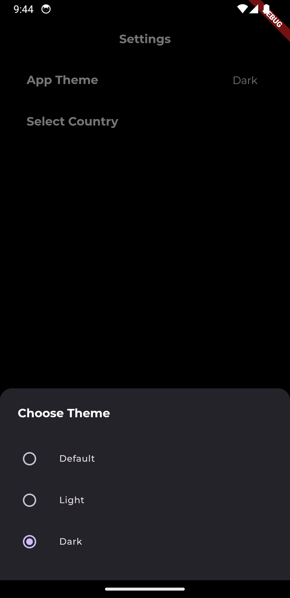

# News4U

News4U is a modern news application developed using Flutter with a clean architecture approach. It leverages RapidAPI to fetch the latest news and incorporates a range of features to enhance user experience, including animations, offline capabilities, and customizable themes.

## Features

- **Get Popular News**: Stay updated with the most popular news articles from around the world.
- **Theme Support**: Switch between light and dark themes to suit your preference.
- **Offline Use**: Access previously loaded news articles even when you're offline.
- **Select Country**: Customize your news feed by selecting your preferred country.
- **News Categories**: Browse news articles by different categories such as sports, technology, business, and more.

## Screenshots

   
.png>)

## Installation

Rapid News API : https://newsapi.org/docs/get-started

## Contributing
Contributions are welcome! Please fork the repository and submit a pull request for any improvements or bug fixes.

